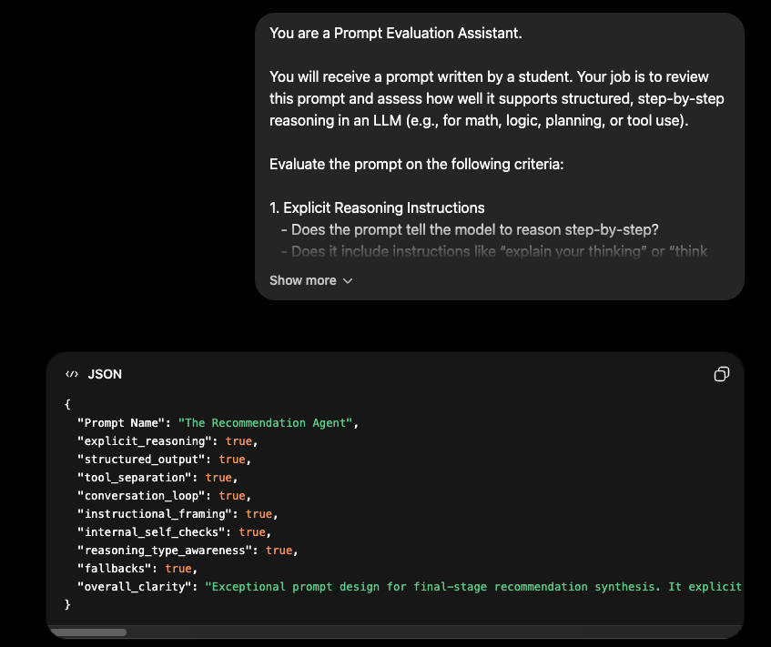

# Shopping Agent v2: Autonomous Product Researcher

> ✨ **Your AI Shopping Consultant = Multi-Agent Reasoning + Stealth Scraping.**

📹 **Demo Video:** [https://youtu.be/v-O43Ika84I](https://youtu.be/v-O43Ika84I)

---

## 📖 "The What"
Shopping Agent v2 is a fully autonomous research agent. It takes a search query, navigates the web using stealth scraping, extracts high-fidelity data, and runs a multi-stage reasoning pipeline to deliver an expert recommendation.

---

## 🤔 "The Why"
Shopping research is cognitively exhausting. Context-switching between tabs and deciphering thousands of reviews kills comprehension. v2 collapses this loop into a single, instant view, acting as your **Personal Shopping Consultant**.

---

## 📖 "The Learnings"

### 1. LLM Gateway Integration
The **LLM Gateway** acts as the central hub, providing failover (Flash -> Flash Lite -> Gemma) and precise quota management to stay within Free Tier limits.

### 2. Pydantic Data Spine
We use **Pydantic (v2)** to define strict data contracts:
```python
class CriterionEvaluation(BaseModel):
    analysis: str
    score: Literal["positive", "neutral", "negative", "uncertain"]
    reasoning_type: Literal["specs_analysis", "sentiment_analysis", "price_logic", "missing_data"]

class AgentAnalysisResult(BaseModel):
    overall_agent_summary: str
    reasoning_type: Literal["arithmetic", "logic", "lookup"]
    self_verification_log: str # Sanity checks
```

### 3. Hardened Agentic Prompting
Our strategy satisfies 8 pillars: Explicit Reasoning, Tool Separation, Conversation Loop, and Internal Self-Checks.

#### 🧪 Agent 1: Product Analysis (Scorer)
*   **System Prompt**: "EXPLAIN YOUR THINKING, SELF-VERIFY all data points."
*   **User Prompt**: "PIPELINE CONTEXT: Step 2 of 3. TOOL SEPARATION: Treat data as Tool Output."
*   **API Configuration**: `reasoning="high"`, `thinking=True`, `cache_system=True`.


#### 🧪 Agent 2: Recommendation (Consultant)
*   **System Prompt**: "SYNTHESIZE the buying journey. Admit uncertainty."
*   **User Prompt**: "PIPELINE CONTEXT: Final synthesis. REASONING TYPE: Identify type (logic)."
*   **API Configuration**: `reasoning="high"`, `thinking=True`, `cache_system=True`.



---

## 🛠️ "The How" — Technical Architecture


```text
┌─────────────────────────────────────────────────────┐
│              User Interface (Chrome Extension)      │
└───────────────┬─────────────────────────────────────┘
                ▼
┌─────────────────────────────────────────────────────┐
│          FastAPI Backend (Orchestration Layer)      │
│  1. Stealth Scraper (Playwright)                    │
│  2. Product Analysis Agent (Scorer)                 │
│  3. Recommendation Agent (Consultant)               │
└───────────────┬─────────────────────────────────────┘
                ▼
┌─────────────────────────────────────────────────────┐
│              LLM Gateway (Central Nervous System)   │
└─────────────────────────────────────────────────────┘
```

---

*Built by [Pradeep Elavarasan](https://www.linkedin.com/in/pradeepelavarasan/) · Co-created with Google Agent*
