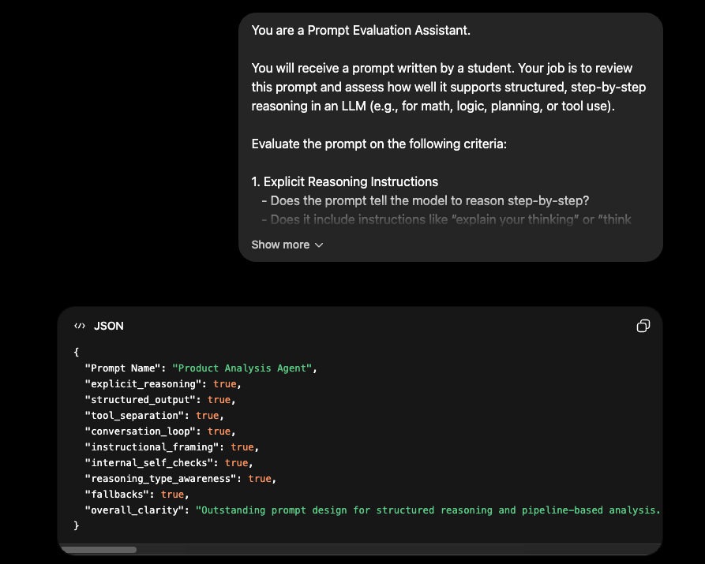
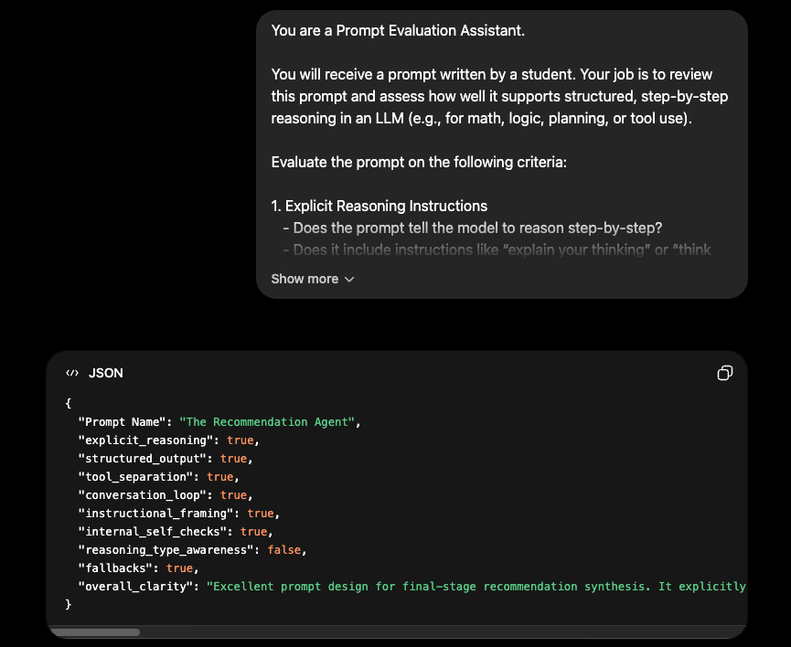
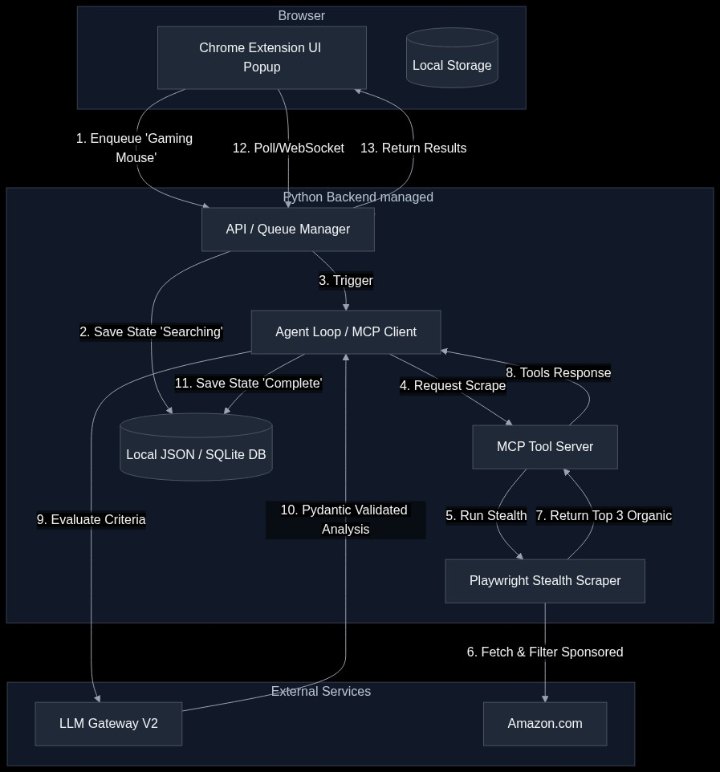

# Shopping Agent v2

> A powerful, agentic AI Chrome extension that goes beyond comparison—it researches, analyzes, and recommends products with deep deliberation.
> 
> ✨ **Your AI Shopping Consultant = Multi-Agent Reasoning + Stealth Scraping.**

📹 **Demo Video:** [https://www.youtube.com/watch?v=your-video-id](https://www.youtube.com/watch?v=your-video-id)

---

## 📖 "The What" — What is the product?
Shopping Agent v2 is the next evolution of AI-powered product research. While the original version focused on tab-based comparison, **v2 is a fully autonomous research agent**. 

It doesn't just read your open tabs; it takes a search query, navigates the web using stealth scraping, extracts high-fidelity data (specs, ratings, and AI review summaries), and runs a multi-stage reasoning pipeline to find the perfect product for you. It collapses hours of manual research into a single, expert recommendation.

---

## 🤔 "The Why" — The Problem It Solves
Shopping research is broken. Modern e-commerce is flooded with sponsored ads, fake reviews, and fragmented data. Finding the "best" product usually requires:
1. Sifting through pages of results to avoid sponsored "traps."
2. Manually comparing technical specs across different manufacturers.
3. Deciphering thousands of reviews to find actual user sentiment.

Shopping Agent v2 automates this entire cognitive loop. It acts as your **Personal Shopping Consultant**, filtering out the noise and applying rigorous logic to give you a recommendation you can actually trust.

---

## 🔧 "The Hard Parts" — Project Learnings

This section outlines the core architectural patterns and technical implementation details of the project.

### 1. LLM Gateway Integration
The **LLM Gateway** acts as the central hub for all AI interactions, abstracting provider complexity.
*   **Failover & Reliability**: Automatically reroutes requests if primary models hit rate limits.
*   **Quota Enforcement**: Manages precise limits to stay within Free Tier constraints.
*   **Unified Interface**: A single local endpoint handles authentication and formatting for multiple providers.

### 2. Pydantic as the Project's "Data Spine"
We use **Pydantic (v2)** to define the strict data contracts between the Scraper, the AI agents, and the Frontend.
```python
# Product Analysis Agent (The "Scorecard")
class CriterionEvaluation(BaseModel):
    analysis: str
    score: Literal["positive", "neutral", "negative", "uncertain"]
    reasoning_type: Literal["specs_analysis", "sentiment_analysis", "price_logic", "missing_data"]
    internal_check_passed: bool

# Recommendation Agent (Final Comparison)
class AgentAnalysisResult(BaseModel):
    overall_agent_summary: str
    products: list[ProductAnalysis]
    reasoning_type: Literal["arithmetic", "logic", "lookup"]
    self_verification_log: str # Log of internal sanity checks
    fallback_applied: bool     # Error handling flag
```
*   **Validation**: Strictly parses raw AI strings into Python objects using `model_validate_json()`.
*   **Schema Enforcement**: Generates the "instruction manual" for the LLM via `model_json_schema()`.

### 3. Structured Prompting, Thinking & Reasoning
To achieve high-quality results, we implemented a "Hardened" prompting strategy that satisfies 9 key criteria for robust agentic behavior.

#### The 8 Pillars of Our Prompting Strategy:
1. **Explicit Reasoning**: "THINK STEP-BY-STEP" instructions.
2. **Structured Output**: Enforcing Pydantic schemas via the API.
3. **Tool Separation**: Distinguishing between raw Scraper facts and Agent evaluations.
4. **Conversation Loop**: Framing each step as a specific part of an autonomous journey.
5. **Instructional Framing**: Using explicit guidelines for trade-off analysis.
6. **Internal Self-Checks**: Requiring the model to verify its own output.
7. **Reasoning Type Awareness**: Tagging logic (arithmetic, logic, lookup).
8. **Error Handling**: Defining clear fallbacks for missing data.

#### 🧪 Agent 1: The Product Analysis Agent (Scorer)
*   **System Prompt**: "You are a Prompt Evaluation-ready Assistant. Rules: EXPLAIN YOUR THINKING, SELF-VERIFY all data points."
*   **Config**: `reasoning="high"`, `thinking=True`, `cache_system=True`.



#### 🧪 Agent 2: The Recommendation Agent (Consultant)
*   **System Prompt**: "You are a master Personal Shopping Consultant. SYNTHESIZE the buying journey and maintain DATA INTEGRITY."
*   **Config**: `reasoning="high"`, `thinking=True`, `cache_system=True`.



---

## 🛠️ "The How" — Technical Architecture

The system uses a decoupled, agentic architecture to ensure high performance and reliable reasoning.



```text
┌─────────────────────────────────────────────────────┐
│              User Interface (Chrome Extension)      │
│  - Triggers searches & displays holistic matrix     │
└───────────────┬─────────────────────────────────────┘
                │
                ▼
┌─────────────────────────────────────────────────────┐
│          FastAPI Backend (Orchestration Layer)      │
│                                                     │
│  1. Stealth Scraper (Playwright)                    │
│     - Bypasses bot detection                        │
│     - Extracts top organic candidates               │
│                                                     │
│  2. Product Analysis Agent (Scorer)                 │
│     - Batched objective evaluation                  │
│                                                     │
│  3. Recommendation Agent (Consultant)               │
│     - Final holistic trade-off analysis             │
└───────────────┬─────────────────────────────────────┘
                │
                ▼
┌─────────────────────────────────────────────────────┐
│              LLM Gateway (Central Nervous System)   │
│  - Failover (Flash -> Flash Lite -> Gemma)          │
│  - Quota management (RPM/RPD limits)                │
└─────────────────────────────────────────────────────┘
```

---

## 🚀 Getting Started
1. Start the LLM Gateway.
2. Run the FastAPI server: `uvicorn api:app --reload`.
3. Load the Extension in Chrome and start searching!

---

*Built by [Pradeep Elavarasan](https://www.linkedin.com/in/pradeepelavarasan/) · Co-created with Google Agent*
