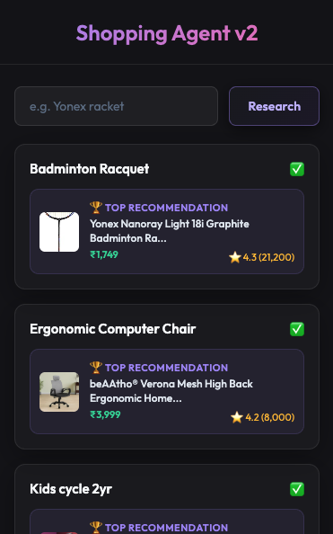
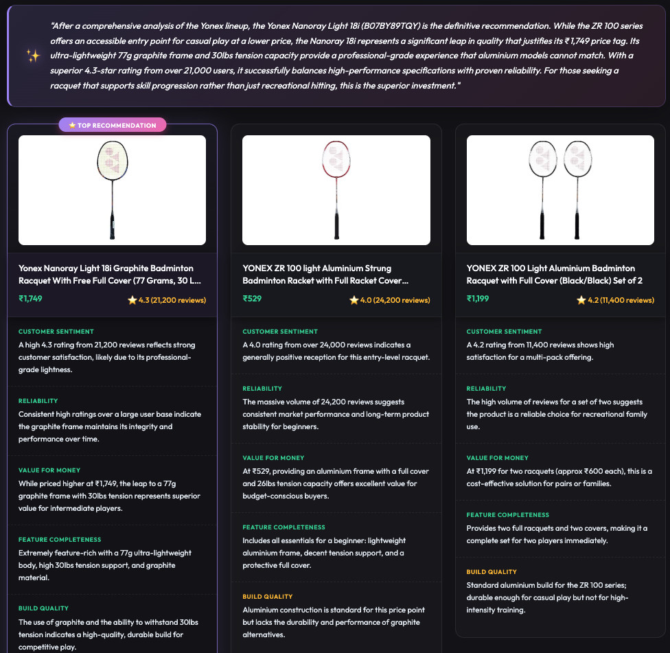

> 🛡️ **Your Personal Shopping Research Assistant: Elevating every purchase decision with autonomous, data-driven expert analysis.**

📹 **Demo Video:** [https://youtu.be/v-O43Ika84I](https://youtu.be/v-O43Ika84I)


<br>



---

## 📖 "The What"
Shopping Agent v2 is a fully autonomous research agent. It takes a search query, navigates the web to extract high-resolution  data, and runs a multi-stage reasoning pipeline to deliver an expert recommendation.

---

## 🤔 "The Why"
Shopping research is cognitively exhausting. Context-switching between tabs and deciphering thousands of reviews kills comprehension. v2 collapses this loop into a single, instant view, acting as your **Personal Shopping Consultant**.

---

## 🛠️ "How to get it"

Follow these steps to set up the environment and run the autonomous researcher locally.

### 1. Prerequisites
- **Python 3.10+** (Recommended: install via [uv](https://github.com/astral-sh/uv))
- **Google Gemini API Key** (Generate at [AI Studio](https://aistudio.google.com/))
- **Playwright** (for web-scale research)

### 2. Installation
```bash
# Clone and enter the repository
git clone https://github.com/pradeepelavarasan/Shopping-Agent-V2
cd Shopping-Agent-V2

# Install dependencies and browsers
uv venv
source .venv/bin/activate
uv pip install -r requirements.txt
uv run playwright install chromium
```

### 3. Standalone Mode (Optional)
This project is modular. If you are not using the internal `llm_gateway`, you can swap the import in `agent.py` to use a direct Gemini call:

```python
# In agent.py, replace the LLM import with a direct mock:
import google.generativeai as genai

class LLM:
    def __init__(self, api_key):
        genai.configure(api_key=api_key)
        self.model = genai.GenerativeModel('gemini-1.5-flash')

    def chat(self, prompt):
        response = self.model.generate_content(prompt)
        return {"parsed": json.loads(response.text)}
```

### 4. Running the Agent
```bash
# Start the server
PYTHONPATH=. uv run uvicorn api:app --port 8000 --reload
```

---

## 📖 "The Learnings"
This section outlines the core architectural patterns and technical implementation details of the project.

### 1. LLM Gateway Integration
The **LLM Gateway** acts as the central hub for all AI interactions, abstracting provider complexity.
*   **Failover & Reliability**: Automatically reroutes requests from Gemini Flash to Flash Lite or Gemma if rate limits (429) are hit.
*   **Quota Enforcement**: Manages precise **RPM (Requests Per Minute)** and **RPD (Requests Per Day)** to stay within Free Tier limits.
*   **Unified Interface**: A single local endpoint handles authentication, retries, and formatting.

## 2. Pydantic as the Project's "Data Spine"
We use **Pydantic (v2)** to define the strict data contracts between the Scraper, the AI agents, and the Frontend.

### A. Core Data Definitions (`schemas.py`)
We use multiple nested models to manage the complex data flow:
```python
# Product Analysis Agent (The "Scorecard")
class CriterionEvaluation(BaseModel):
    analysis: str
    score: Literal["positive", "neutral", "negative", "uncertain"]
    reasoning_type: Literal["specs_analysis", "sentiment_analysis", "price_logic", "missing_data"]
    internal_check_passed: bool

# Recommendation Agent (Final Comparison)
class AgentAnalysisResult(BaseModel):
    overall_agent_summary: str
    products: list[ProductAnalysis]
    reasoning_type: Literal["arithmetic", "logic", "lookup"]
    self_verification_log: str # Log of internal sanity checks
    fallback_applied: bool     # Error handling flag
```

### B. Advanced JSON Operations
*   **`model_json_schema()`**: Automatically generates the "instruction manual" sent to the LLM Gateway to enforce Strict Mode.
*   **`model_validate_json()`**: Strictly parses and validates raw AI strings into Python objects, ensuring no "hallucinated" fields enter our system.
*   **`model_dump_json()`**: Standardizes the "Round Trip" from the Python backend to the Javascript Chrome extension.

### 3. Structured Prompting, Thinking & Reasoning
To achieve high-quality results, we implemented a "Hardened" prompting strategy that satisfies 9 key criteria for robust agentic behavior.

#### The 8 Pillars of Our Prompting Strategy:
1.  **Explicit Reasoning**: Instructing the model to "THINK STEP-BY-STEP".
2.  **Structured Output**: Enforcing Pydantic schemas via the API.
3.  **Tool Separation**: Distinguishing between raw Scraper facts and Agent evaluations.
4.  **Conversation Loop**: Framing each step as a specific part of an autonomous journey.
5.  **Instructional Framing**: Using explicit guidelines for trade-off analysis.
6.  **Internal Self-Checks**: Requiring the model to verify its own output.
7.  **Reasoning Type Awareness**: Tagging logic (arithmetic, logic, lookup).
8.  **Error Handling**: Defining clear fallbacks for missing data.

#### 🧪 Agent 1: The Product Analysis Agent (Scorer)
*   **System Prompt**: 
    > "You are a Prompt Evaluation-ready Assistant. Rules: EXPLAIN YOUR THINKING, SELF-VERIFY all data points, and return ONLY valid JSON matching the schema."
*   **User Prompt**:
    > "Evaluate these products: {product_data} against these criteria: {priorities}. 
    > **PIPELINE CONTEXT**: Step 2 of 3. You are receiving output from the Step 1 'Web Search Tool'.
    > **TOOL SEPARATION**: Treat provided data as 'Tool Output'. Do not use external knowledge.
    > **REASONING TYPE**: Identify logic (specs_analysis, sentiment_analysis, or price_logic).
    > **INTERNAL SELF-CHECK**: Verify ASIN and price match input exactly."
*   **API Configuration**:
    ```python
    reply = llm.chat(
        system=STAGE1_SYSTEM_PROMPT,
        cache_system=True, reasoning="high", thinking=True, temperature=0,
        response_format=Stage1BatchEvaluation.model_json_schema()
    )
    ```


#### 🧪 Agent 2: The Recommendation Agent (Consultant)
*   **System Prompt**: 
    > "You are a master Personal Shopping Consultant. SYNTHESIZE the buying journey, maintain DATA INTEGRITY, and admit uncertainty if it arises."
*   **User Prompt**:
    > "**PIPELINE CONTEXT**: Final synthesis step. Closing the conversation loop.
    > **TOOL SEPARATION**: Distinguish between 'Raw Data' (Scraper) and 'Scorecards' (Product Analysis Agent).
    > **REASONING TYPE AWARENESS**: Identify the type (arithmetic, logic, lookup). Set to 'logic'.
    > **THINK STEP-BY-STEP**: Compare scorecards and identify clear winners."
*   **API Configuration**:
    ```python
    reply = llm.chat(
        system=STAGE2_SYSTEM_PROMPT,
        cache_system=True, reasoning="high", thinking=True, temperature=0,
        response_format=AgentAnalysisResult.model_json_schema()
    )
    ```


---

## 🛠️ "The How" — Technical Architecture
Shopping Agent v2 is built on a distributed pipeline that balances high-speed data extraction with complex agentic reasoning.

### 📍 The Autonomous Research Pipeline
Unlike traditional comparison tools that require manual data entry, v2 utilizes an **Autonomous Discovery Loop**. When a query is received, the system initiates a multi-stage data journey:
*   **Discovery Phase**: The engine performs an initial sweep of the search space to identify the top 20 candidates, ensuring the evaluation pool is grounded in current organic results.
*   **High-Fidelity Extraction**: For the market leaders, the system performs direct page-processing to extract deep sentiment data, including raw consumer reviews and AI-generated summaries.

### 🧠 Multi-Agent Orchestration
To ensure maximum precision, the decision-making is partitioned into specialized AI layers:
1.  **The Analytical Layer**: Processes raw product facts into structured "Scorecards," mapping every specification against your unique priorities.
2.  **The Synthesis Layer**: Acts as the final expert consultant, weighing the scorecards to identify trade-offs and penning a holistic recommendation.
3.  **The Reliability Broker**: All AI interactions are managed by a central gateway that ensures consistent formatting, manages quotas, and handles automatic model failovers.

---

### 🗺️ Data Flow & Architecture Diagram


```text
┌─────────────────────────────────────────────────────┐
│              User Interface (Chrome Extension)      │
└───────────────┬─────────────────────────────────────┘
                ▼
┌─────────────────────────────────────────────────────┐
│          FastAPI Backend (Orchestration Layer)      │
│                                                     │
│  1. Scraper (Playwright) → DISCOVERS 20 ITEMS       │
│  2. Agent 1 (Scorer)    → BUILDS SCORECARDS        │
│  3. Agent 2 (Consultant) → FINAL VERDICT           │
└───────────────┬─────────────────────────────────────┘
                ▼
┌─────────────────────────────────────────────────────┐
│              LLM Gateway (Central Nervous System)   │
│  (Rate Limiting | Failover | Quota Management)      │
└─────────────────────────────────────────────────────┘
```

---

*Built by [Pradeep Elavarasan](https://www.linkedin.com/in/pradeepelavarasan/) · Co-created with Google Agent*
